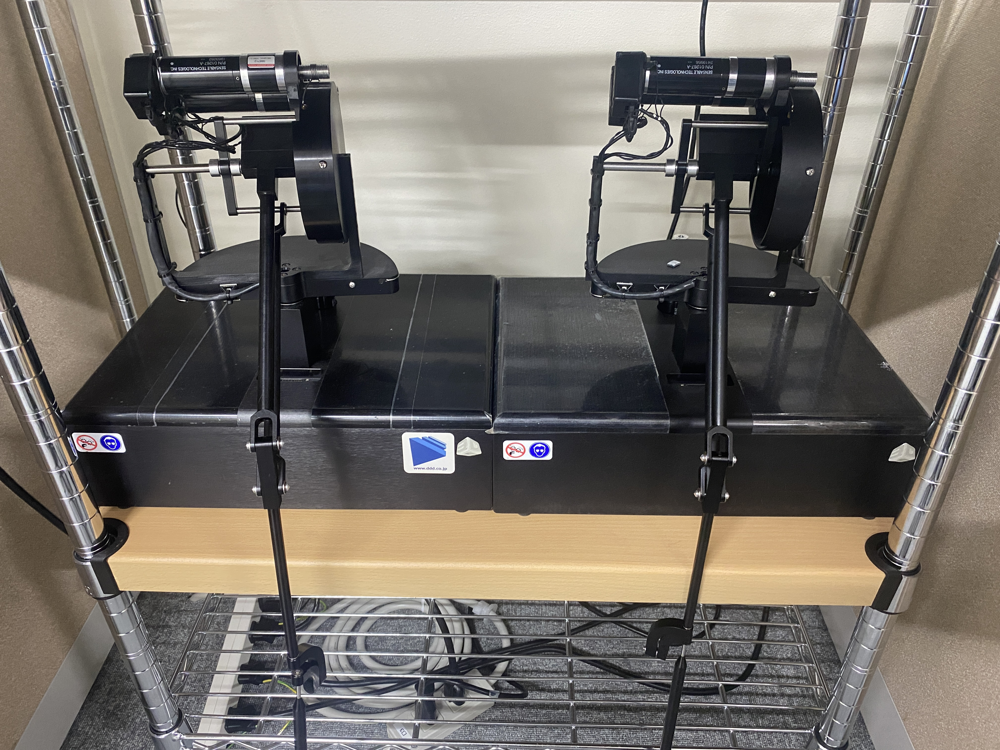
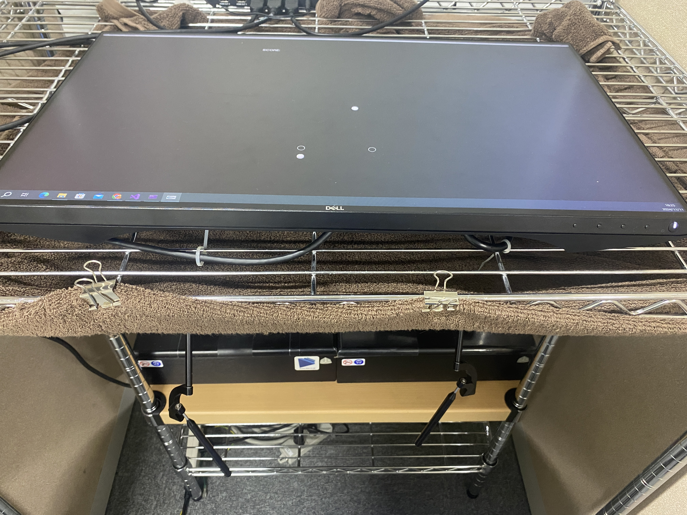
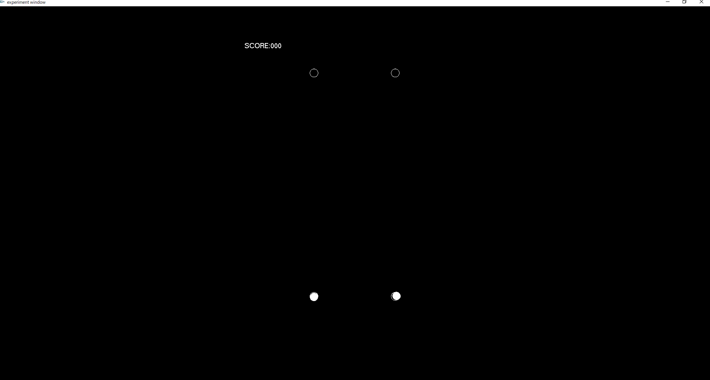

## 腕到達運動時の運動軌道計測システム

### 使用デバイス
3Dsystems社のハプティックデバイスであるPhantom Premium 1.5HF  

### 実験時環境
下図のようにディスプレイ下にハプティックデバイスを隠れるように置き，座った際にディスプレイによってデバイスの持ち手部分を見えないようにする．  
  
視覚運動回転変換という視覚フィードバックに回転座標変換を加えた実験では，このようにすることが多い．  

### 実際の運動課題
上記の状態で画面上に映るカーソルをデバイスのハンドルを動かすことによって制御し，ターゲットに到達させる課題を行う．  
その際の運動軌道，力のプロファイルなど様々データを取得できるようにしている．  

